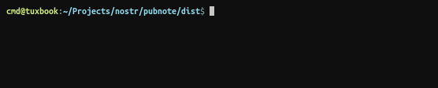
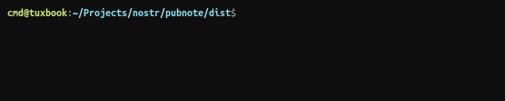

# pubnote

  


Send encrypted notes between terminals, from anywhere to anywhere, using the power of nostr.

## Installation

This program is designed to run as a simple binary. No installation required.

## Usage

```ts
/**
Usage: 
  Machine A: pubnote -s 'secretphrase' recv
  Machine B: pubnote -s 'secretphrase' send "whatever" "you" "want"

Options:
  --key     -k privkey  : Specify a 32 byte private key to use for signatures.
                          Must provide in string hex format.

  --pass    -s password : Specify the secret passphrase to use. The secret is
                          hashed and used for end-to-end routing and encryption.
  --relay   -r address  : Set the relay to use. Default relay is currently set
                          to ${DEFAULT_RELAY}
  
  --silent  -s          : Enable silent output (for better use in scripts).

  --timeout -t          : Time to keep connection open (in milliseconds).
                          Default is ${DEFAULT_TIMEOUT}ms.
  
  --verbose -v          : Enable verbose debug output.  
*/
```

## How it Works

Your secret is hashed and use to encrypt each note over the wire. The note itself is tagged with a secure hash of the secret, which both parties use to delvier the note. The note is delivered over a relay (of your choice) using the nostr protocol.

That's about it really. I wanted to keep this simple.

## Development

The project is setup to build standalone binaries using `pkg`. Simply run `yarn build`, then check the `dist` folder for the output.

## Resources

**Noble-secp256k1 Library**  
Used for identity and signing events.  
https://github.com/paulmillr/noble-secp256k1

**Websockets** (nodejs only)  
Used for communicating over a websocket.  
https://github.com/websockets/ws

**Nostr Implementation Possibilities**  
https://github.com/nostr-protocol/nips

**Nostr-Emitter**  
https://github.com/cmdruid/nostr-emitter

## Contributions
All contributions are welcome!
